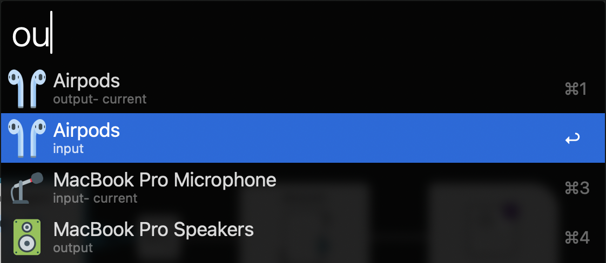

# Audio Source Switcher

This workflow utilizes the `SwitchAudioSource` command line utility to switch between audio sources on your Mac.
It has support for both input and output devices and can be easily configured with minor JQ knowledge.

<p align="center">
  
</p>

# Setup

1. Install `switchaudio-osx` via Brew:
```zsh
brew install switchaudio-osx
```

2. Use `make install` to create a symlink to alfred's workflow folder or download the latest release from the [releases page](https://github.com/Boettner-eric/Alfred/releases) and import into Alfred.


# Configuration
- Set your trigger keyword in the `Configure Workflow` menu
- Add devices to the denylist to hide them from alfred's options
