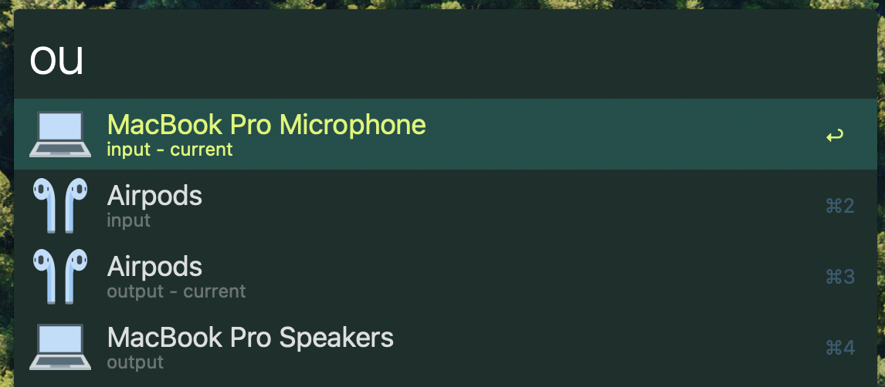
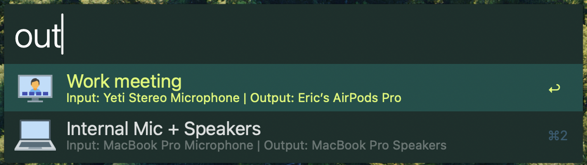

# Audio Source Switcher

This workflow utilizes the `SwitchAudioSource` command line utility to switch between audio sources on your Mac.
It has support for both input and output devices and can be easily configured with minor JQ knowledge.

*Change devices quickly via alfred*

*Create scenes to group input and output devices*

# Setup

- Install `switchaudio-osx` via Brew: `brew install switchaudio-osx`
- Use `make install` to create a symlink to alfred's workflow folder
- Set your trigger keywords in the `Configure Workflow` menu
- Set a hotkey for the input mute
- Add devices to the denylist to hide them from alfred's options

# Features
- Globally mute input device
- Change default audio devices
- Create scenes for input/output settings
- Use alfred url scheme to change devices

# Mods
- `⌘` -> set as output
- `⌃` -> set as input
- `⌥` -> copy device name (useful for denylist)
- `⇧` -> toggle input/output mute state
