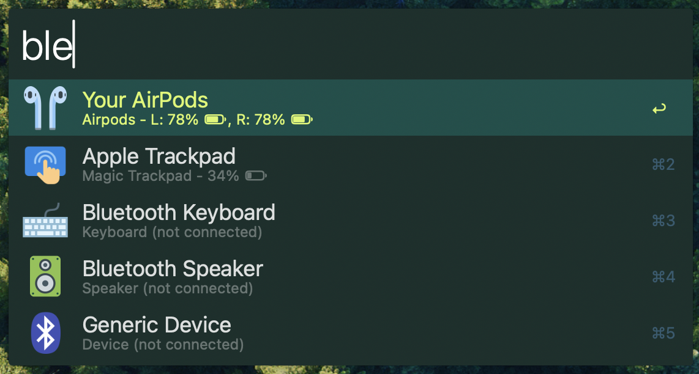

# Bluetooth Connector

- connect and disconnect bluetooth devices
- favorite a bluetooth device for quick hotkey/url connect

# Setup

- download [SF Pro](https://developer.apple.com/fonts/) font for battery icons
- install blueutil `brew install blueutil`
- set your trigger commands
- select a bluetooth device and use `⌘` + `⏎` to mark it as your airpods
- bind the hotkey to quick connect

# Mods

- `⌘` -> mark device as airpods
- `⌥` -> copy bluetooth address (with :)
- `⌃` -> copy bluetooth address (with -)

# Credit

A lot of this workflow is based off of [bluetooth-device-battery](https://alfred.app/workflows/zeitlings/bluetooth-device-battery/) and [airpods-connector](https://github.com/mariuskiessling/alfred-airpods-connector). I wanted to do a full rewrite in JQ to optimize the speed and resources while still maintaining the base features I am used to.
