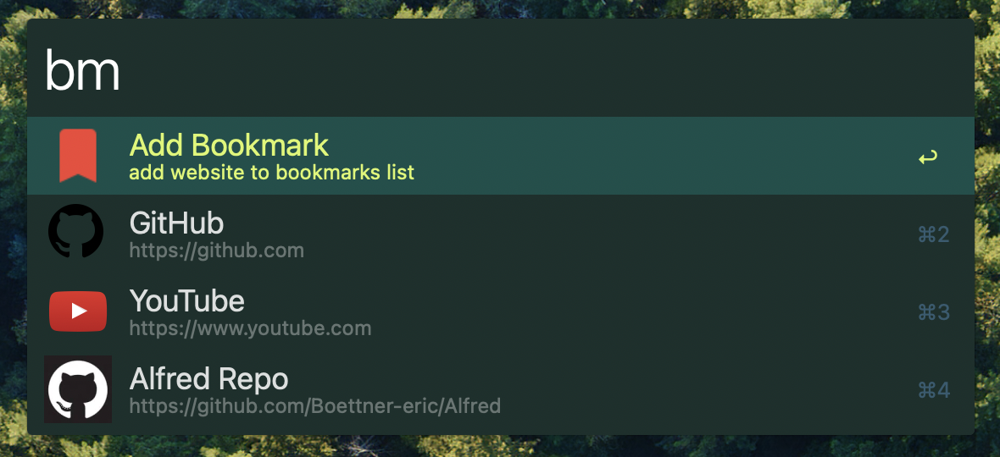

# Bookmarks Workflow
Use alfred to quickly jump to your bookmarks. Sync them across devices via a simple json file.

# Setup
- `make install` to build `.venv/` and create the alfred symlink
- modify the json file to include your most used websites
- add icons to the `/icons` folder

# Usage
- `bm [name]` to jump to a bookmark
- `bma [name] [url] [description]` to add one
- `bme [name] [url] [description]` to change where an existing one points
- `bme [mod] [name] [url] [description]` to bind a second url to a modifier
- `bme [mod] [name]` to unbind that modifier
- `bms [name]` to save the page open in Arc

Names match case insensitively and may contain spaces - the url is whatever
looks like one, and anything after it is the description. Leave the description
off and a bound url borrows the page's own `<title>` instead.

# Mods
- `⌘` / `⌥` / `⌃` / `fn` -> open the url bound to that key, or the main one if nothing is bound
- `⇧` -> copy rather than open, so `⌘⇧` copies the url `⌘` would have opened

Bindings live under each entry's `mods` object in `common.json` and can be
hand-edited too. The `⇧` copy variants are generated on the fly, so they never
need to be written down.

## TODO
- get bookmarks from chrome export
