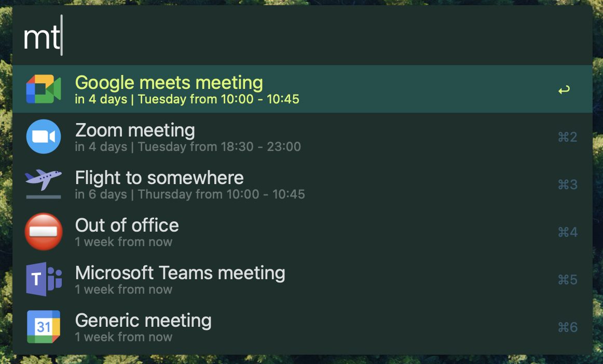

# Meetings Calendar

Jump to slack huddles, zoom rooms and google meets directly from alfred. 

# Setup
- setup your google calendar api access via this [guide](https://developers.google.com/workspace/calendar/api/quickstart/python#set-up-environment)
- save your generated `credentials.json` to this folder
- `make install` to create alfred symlink
- `pip3 install -r requirements.txt` to install python requirements
- `mcr NAME` in alfred to register each google account

# Mods
- `⌘` -> show meeting url
- `⌃` -> show start and end times
- `⌥` -> open event in calendar

# Run
- `alfred://runtrigger/boettner.eric.meetings_calendar/calendar`

# How it runs
- `meetings.jq` reads the last cached `meetings.json` file and instantly updates the script filter
- `meetings.py` runs in the background and updates `meetings.json`
- if the cache is stale then `meetings.jq` reruns the workflow at the lowest possible timing

I chose to use jq here to quickly parse the json data and give the user meetings as fast as possible