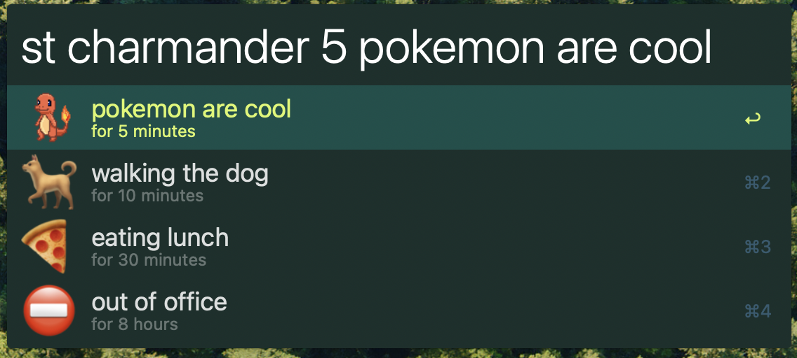

# Slack Status
Change your slack status via alfred

# Warning
Fetching all emotes from your slack server will take a long time and might run into issues.

# Setup
- create `.env.local` and set `SLACK_TOKEN` to your slack access token
- `make install` to create alfred symlink
- `yarn install` to get default emojis
- `pip3 install -r requirements.txt` to fetch python dependencies
- `python3 status.py -g` to fetch your slack specific emotes (note this will take time and space depending on how many you have)
