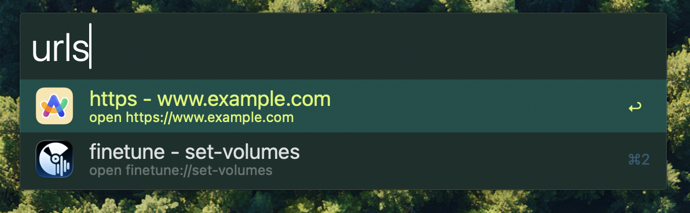
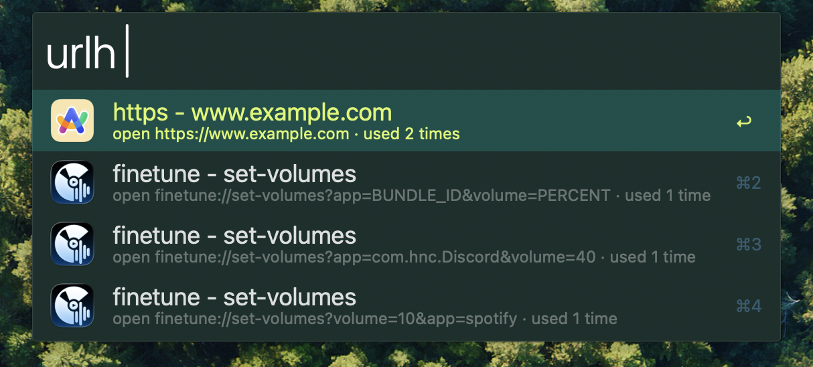

# Url Schemes

Mac apps use URL schemes for scripting and automatons and this workflow serves to capture and organize them.

_Fill in a url with params and launch it from alfred_

_See history of urls and Browser/Jump to a specific url_

# Setup

- call `urla` with your first url

# Features

- Add any url with custom params
- Fill out a URL template
- Save history of urls
- Favorite URLs (todo)

# Mods

- ` ` -> Go to URL
- `⌘` -> Copy URL
- `⌥` -> NA
- `⌃` -> NA
- `⇧` -> NA
