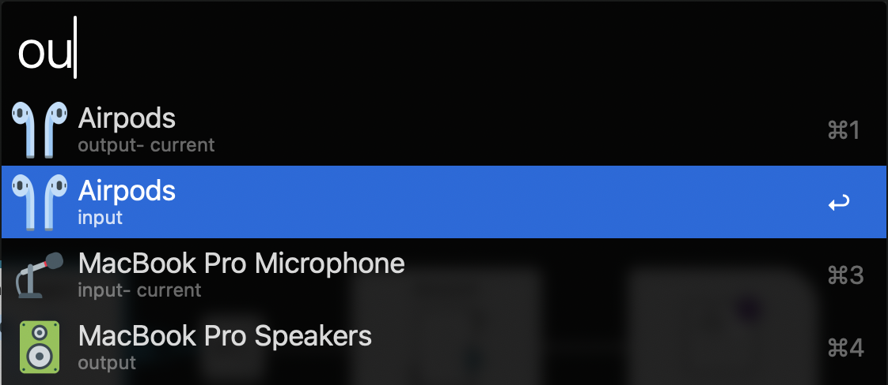

## Audio Switcher

This workflow utilizes the `SwitchAudioSource` command line utility to switch between audio sources on your Mac.
It has support for both input and output devices and can be easily configured with minor JQ knowledge.



## Getting Started

### Installation

#### a) Git Managed

Like my other workflows you can run

```zsh
ln -s -T $(PWD) ~/Library/Application\ Support/Alfred/Alfred.alfredpreferences/workflows/user.workflow.audio-source
```

(or `make install` if you're lazy) from this directory to add this workflow to Alfred. This installation method allows you to use git to keep this workflow up to date without having to package and re-import it into Alfred.

_note: if you have a different Alfred application directory you will need to change the path in the command above._

#### b) Alfred Managed

If you would rather not use git to manage this workflow you can download the latest release from the [releases page](https://github.com/Boettner-eric/Alfred/releases) and import it into Alfred.

### Usage

- Setup your default trigger keyword in the `Configure Workflow` menu
- Use the trigger keyword to switch between audio sources
