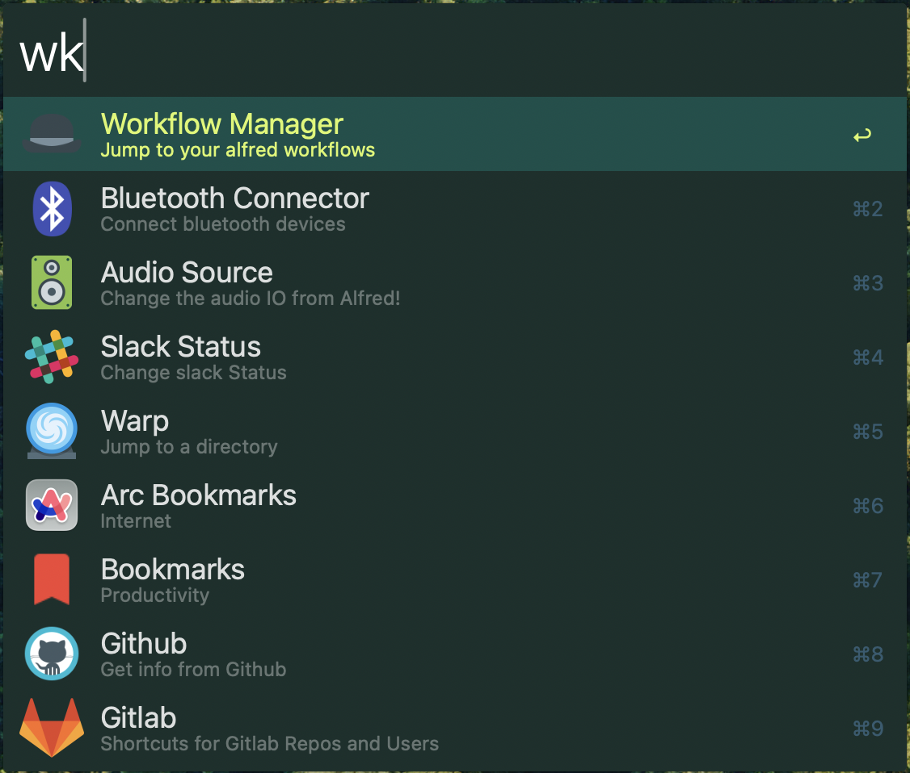

# Workflow Manager
A simple workflow for quickly viewing and editing workflows

# Usage 
- set `editor` and `terminal` to your preferred apps
- run `jq --arg editor $editor --arg terminal $terminal -f alfred.jq workflows.json` to see the parsed output

# Mods
- `⌘` -> open in IDE
- `⌥` -> open in Terminal
- `⌃` -> reveal in finder
- `⇧` -> open workflow source in browser
